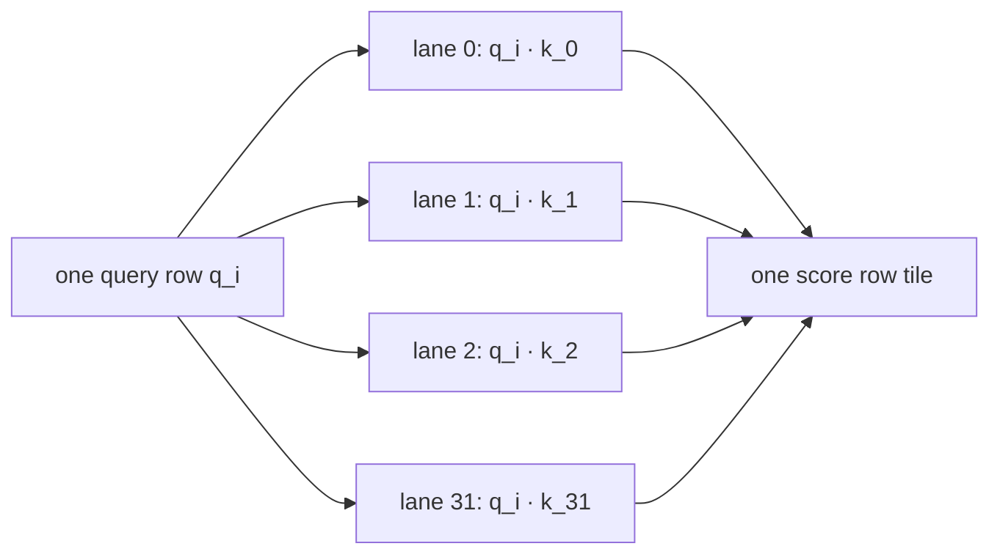
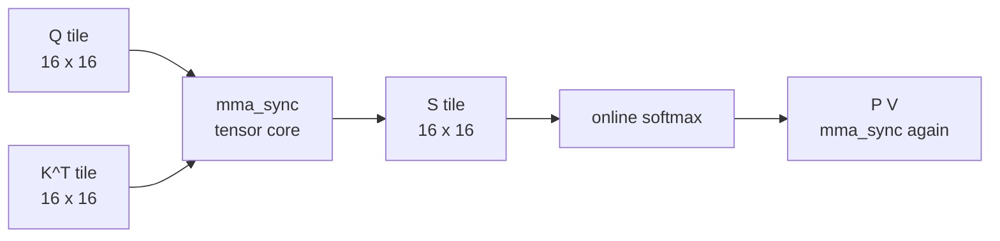
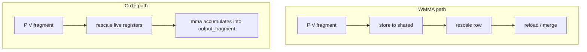
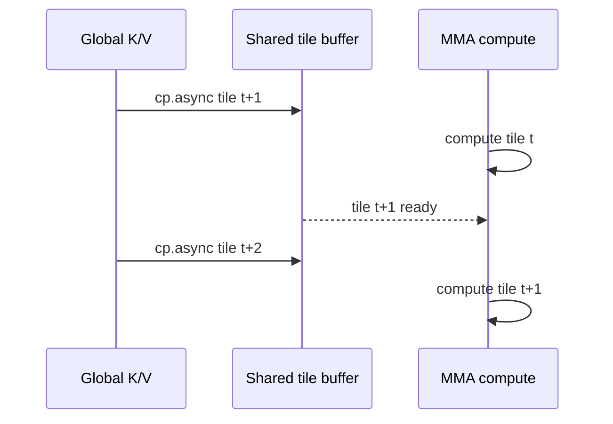
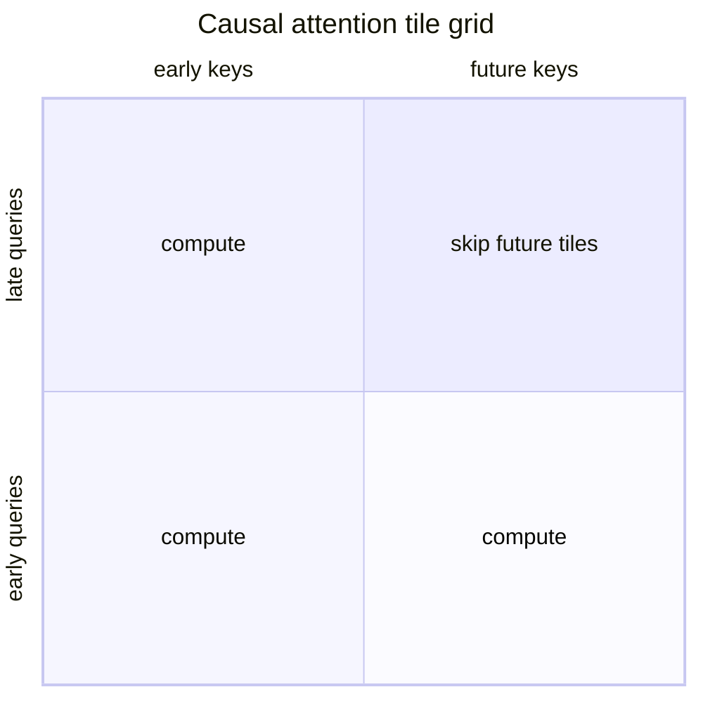

# Short-form visual storyboard: CUDA C++ vs JAX attention

Purpose: source material for a 60-90 second vertical video. Each beat pairs
one readable code snippet with one simple diagram. The snippets are deliberately
readable on a phone-format canvas; the full source files hold
the derivations and comments.

Recommended renderer: a markdown slide tool that supports fenced code blocks
and Mermaid. If Mermaid rendering is awkward, render the Mermaid source as
plain text or recreate the diagrams as simple boxes in Keynote/Canva.

## Capture style

- Canvas: 9:16 vertical, 1080 x 1920.
- Terminal/code font: 28-36 px for code, 42-56 px for titles.
- One idea per screen. Do not show whole functions.
- Put the source filename in a small footer. It proves this is real code.
- Highlight the `// MONEY LINE` comment in the rendered slide.

## Beat 1: scalar CUDA - right algorithm, wrong engine

Narration:

> My first FlashAttention kernel had the right algorithm: stream K/V tiles,
> compute online softmax, never build the N-by-N matrix. But the dot products
> were scalar FMAs on CUDA cores.

Code:

```cpp
// flash_attention_warp_cooperative.h
// MONEY LINE: one lane computes one q_i · k_j dot product.
AccT dot {0};
#pragma unroll
for (int d {0}; d < kHeadDim; ++d)
{
  dot += shared_queries[warp_rank][d] * shared_keys[lane][d];
}
score = dot * scale;
```

Diagram:



On-screen label:

> Scalar CUDA: the FlashAttention memory trick is there, but the math engine
> is one FMA at a time.

## Beat 2: WMMA - same algorithm, tensor-core inner products

Narration:

> The first engine upgrade was WMMA. Same tiling, same masking, same online
> softmax. But QK^T and P V moved from scalar loops to tensor-core matrix
> multiply instructions.

Code:

```cpp
// flash_attention_tensor_core.h
// MONEY LINE: one tensor-core instruction computes a 16x16x16 tile.
wmma::load_matrix_sync(query_fragment, q_ptr, kHeadDim);
wmma::load_matrix_sync(key_fragment, key_ptr, kHeadDim);
wmma::mma_sync(
  score_fragment,
  query_fragment,
  key_fragment,
  score_fragment);
```

Diagram:



On-screen label:

> WMMA: same FlashAttention loop, faster inner-product engine.

## Beat 3: CUTLASS/CuTe - remove the shared-memory round trip

Narration:

> WMMA helped, but its fragments are opaque: a lane does not know which row
> its registers belong to. CuTe gives me coordinates for the accumulator, so
> I can rescale the live output fragment in registers and keep accumulating.

Code:

```cpp
// flash_attention_cute.h
// MONEY LINE: rescale the live output fragment in registers.
for (int i {0}; i < size(output_fragment); ++i)
{
  output_fragment(i) *=
    shared_rescale[warp_rank][get<0>(output_coordinates(i))];
}

gemm(tiled_mma, p_fragment, v_fragment, output_fragment);
```

Diagram:



On-screen label:

> CuTe: coordinate tensors make the register layout visible.

## Beat 4: cp.async - overlap memory movement with math

Narration:

> CuTe also gives the kernel-building pieces for the next optimization:
> double-buffer K/V tile copies with cp.async, so the next tile is moving
> while the current tile is computing.

Code:

```cpp
// flash_attention_cute.h
// MONEY LINE: async 128-bit K/V tile copy into shared memory.
TiledCopy tiled_copy {make_tiled_copy(
  Copy_Atom<SM80_CP_ASYNC_CACHEGLOBAL<uint128_t>, half_t>{},
  Layout<Shape<_16, _8>, Stride<_8, _1>>{},
  Layout<Shape<_1, _8>>{})};

copy(tiled_copy, thr_copy.partition_S(k_global),
     thr_copy.partition_D(k_smem));
```

Diagram:



On-screen label:

> cp.async: move the next tile while tensor cores work on this one.

## Beat 5: causal masking - skip work, don't compute then throw away

Narration:

> Causal attention masks future tokens. The naive path computes the masked
> half and throws it away. A tiled kernel can skip whole future K/V tiles.

Code:

```cpp
// flash_attention_tensor_core.h
// MONEY LINE: skip K/V tiles wholly past this query block.
if (kCausal)
{
  const int last_query_in_block {block_row_start + kBlockRows - 1};
  const int last_needed_tile {last_query_in_block / kTile};
  number_of_tiles = (last_needed_tile + 1 < number_of_tiles) ?
    last_needed_tile + 1 : number_of_tiles;
}
```

Diagram:



Fallback diagram if quadrant charts do not render:

```text
K/V tiles →
Q blocks ↓
  [compute] [skip   ] [skip   ] [skip   ]
  [compute] [compute] [skip   ] [skip   ]
  [compute] [compute] [compute] [skip   ]
  [compute] [compute] [compute] [compute]
```

On-screen label:

> Causal masking: compute the lower triangle only.

## Beat 6: benchmark output - the punchline

Run:

```bash
cd /InServiceOfX/CUDALibraries/CuLLM/BuildGcc
./WarpAttentionBenchmark
```

For a faster rehearsal run:

```bash
./WarpAttentionBenchmark --repeats 5 --warmups 2
```

For a more stressful visual on the RTX 3060:

```bash
./WarpAttentionBenchmark --stress
```

Output target:

```text
Readable summary
Fixed kernel shape: d = 64 per head, warps/block = 4. Runtime slices: batch*heads = 96.

Non-causal fp16 engine ladder
| N | scalar fp16 | WMMA | CuTe | scalar/CuTe | WMMA/CuTe |
...

Causal tile skipping
| N | float32 non-causal | float32 causal | speedup | CuTe non-causal | CuTe causal | speedup |
...
```

Narration:

> This is the same hardware, same inputs, same shapes. At N=2048, scalar fp16
> is about 151 ms, WMMA is about 52 ms, and CuTe is about 19 ms. The algorithm
> removes the memory wall; the engine upgrades close the speed gap.

## Beat 7: stress output - what still stays quadratic

Run:

```bash
cd /InServiceOfX/CUDALibraries/CuLLM/BuildGcc
./WarpAttentionBenchmark --stress
```

Output target:

```text
| 4096 | ... | CuTe 75.98 | ... |
| 8192 | ... | CuTe 304.20 | ... |

Stress note: N doubles 4096 -> 8192, but exact dense attention work is
quadratic. CuTe non-causal ... (about 4x); CuTe causal ... (about 4x).
Causal stays near 2x faster because future tiles are skipped.
```

Narration:

> Here N is the context length: the number of tokens in the attention window.
> Stress mode doubles N from 4096 to 8192. Runtime goes up about 4x, not 2x,
> because FlashAttention removes the quadratic memory allocation, not the
> quadratic dot-product work. But causal masking stays near 2x faster, because
> the kernel skips future tiles instead of computing them and throwing them
> away.

On-screen label:

> FlashAttention removes N² memory. Exact dense attention still has N² compute.

## Beat 8: JAX comparison output

Run inside the Docker container:

```bash
cd /InServiceOfX
PYTHONPATH=CUDALibraries/CuLLM/Python python3 \
  CUDALibraries/CuLLM/Python/benchmark_report.py \
  --build-dir CUDALibraries/CuLLM/BuildDocker
```

Output target:

```text
<!-- JAX 0.10.2, devices [CudaDevice(id=0)] -->

## Attention forward core, non-causal ...
| N | CuLLM warp-coop CUDA | JAX/XLA standard ... |

## Accuracy: CuLLM CUDA vs JAX FA-2
| N | d | causal | max abs difference |
```

Narration:

> JAX is not slow Python. JAX is an XLA frontend, and XLA is very good when
> your computation fits its fusion patterns. The reason to write CUDA is not
> ego; it is when you can name the exact thing XLA cannot express for your
> case: a memory wall, a skip pattern, or a fused kernel boundary.

## Suggested final voiceover

> I wrote FlashAttention from scratch in CUDA and compared it against JAX/XLA
> and cuDNN. The first version had the right algorithm but the wrong engine:
> scalar CUDA cores. WMMA moved the inner products onto tensor cores. CuTe kept
> the accumulator in registers and overlapped tile loads with cp.async. Causal
> masking skipped future tiles instead of computing and discarding them. In
> stress mode, doubling context length still costs about 4x, which is the
> honest caveat: exact attention remains quadratic in compute. The lesson is
> simple: FlashAttention wins the memory game; tensor cores win the compute
> game; cuDNN does both.
